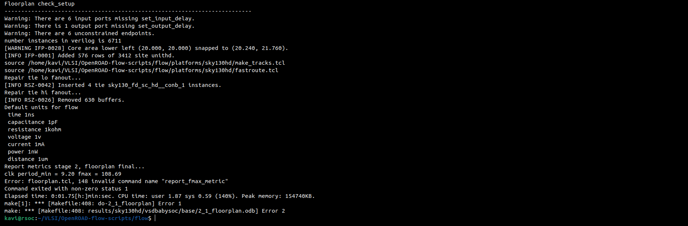

# Week 5 Task – OpenROAD Flow Setup and Floorplan + Placement

## Install OpenROAD Flow Scripts

1. clone the repo with submodules
   
   ```bash
   git clone --recursive https://github.com/The-OpenROAD-Project/OpenROAD-flow-scripts
   cd OpenROAD-flow-scripts
   ```
   
    

2. run setup script with root permissions, 
   
   ```bash
   sudo ./setup.sh
   ```
   
   

3. Build OpenROAD
   
   ```shell
   ./build_openroad.sh --local --threads 1
   ```
   
   ~~NOTE: The local build failed so i resorted to using prebuilt binaries from [Using Pre-built Binaries &#8212; OpenROAD Flow documentation](https://openroad-flow-scripts.readthedocs.io/en/latest/user/BuildWithPrebuilt.html)~~
   
   


4. verifying installation
   
   ```shell
   source ./env.sh
   yosys -V  
   openroad -version
   ```
   
    

## Execute Floorplan and Placement

### Create floorplan

```
make DESIGN_CONFIG=./designs/sky130hd/vsdbabysoc/config.mk floorplan
```




