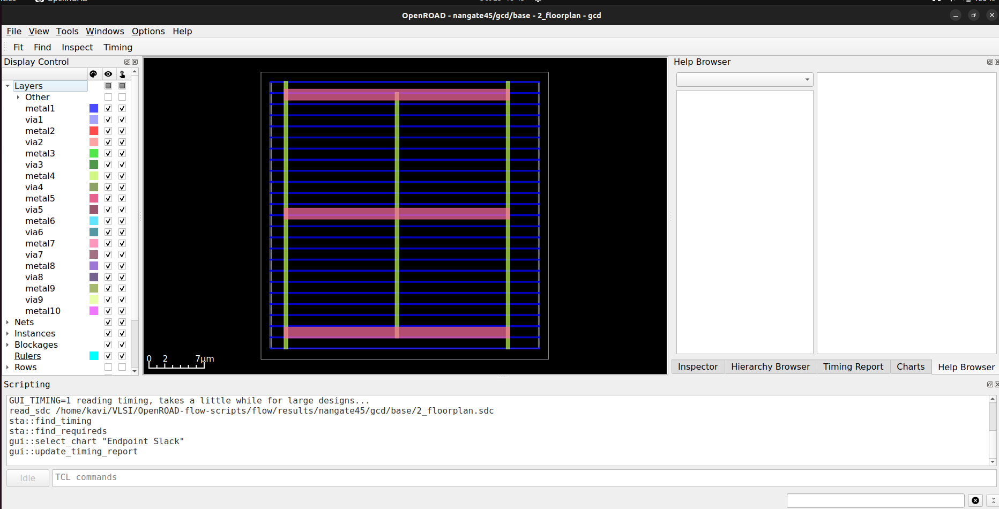

# Week 5 Task – OpenROAD Flow Setup and Floorplan + Placement

***<u>Acknowledgments</u>*** - github issue discussion [issue35](https://github.com/vsdip/IndiaRiscvTapeoutProgram/issues/35) and user [akhileshkumarp](https://github.com/akhileshkumarp/)'s documentation on common errors and their workarounds - [openroad_error_fixes_guidance_Akhilesh.pdf](https://github.com/user-attachments/files/23129333/openroad_error_fixes_guidance_Akhilesh.pdf)

## Install OpenROAD Flow Scripts

1. clone the repo with submodules
   
   ```bash
   git clone --recursive https://github.com/The-OpenROAD-Project/OpenROAD-flow-scripts
   cd OpenROAD-flow-scripts
   ```
   
    

2. run setup script with root permissions, 
   
   ```bash
   sudo ./setup.sh
   ```
   
   

3. Build OpenROAD
   
   ```shell
   ./build_openroad.sh --local --threads 1
   ```
   
   Issues faced - 
   
   1. make stops at 63% - solution: increase ram to more than 5 gb, storage to 50 gb and run with `--thread 1` in the build script
   
   2. make stops at 97% - google test framework linking issue. solution - ignore for now 
   
   NOTE: `./build_openroad.sh --local` installs the packages system wide so they dont recide in the expected directory. so this snippet needs need to be added before every command to let the tool know of the installation directory:
   
   ```shell
   YOSYS_EXE=/OpenROAD-flow-scripts/tools/yosys/yosys  
   OPENROAD_EXE=/OpenROAD-flow-scripts/tools/OpenROAD/build/bin/openroad make
   ```
   
   ~~NOTE: The local build failed so i resorted to using prebuilt binaries from [Using Pre-built Binaries &#8212; OpenROAD Flow documentation](https://openroad-flow-scripts.readthedocs.io/en/latest/user/BuildWithPrebuilt.html)~~
   
   

4. verifying installation
   
   ```shell
   source ./env.sh
   yosys -V  
   openroad -version
   ```
   
    

## Execute Floorplan and Placement

### Flow for example design

#### Create floorplan

```shell
YOSYS_EXE=/OpenROAD-flow-scripts/tools/yosys/yosys  
OPENROAD_EXE=/OpenROAD-flow-scripts/tools/OpenROAD/build/bin/openroad 
make floorplan
```


```shell
YOSYS_EXE=/OpenROAD-flow-scripts/tools/yosys/yosys  
OPENROAD_EXE=/OpenROAD-flow-scripts/tools/OpenROAD/build/bin/openroad 
make gui_floorplan
```



#### Create placement

```shell
YOSYS_EXE=/OpenROAD-flow-scripts/tools/yosys/yosys  
OPENROAD_EXE=/OpenROAD-flow-scripts/tools/OpenROAD/build/bin/openroad 
make place
```


```shell
YOSYS_EXE=/OpenROAD-flow-scripts/tools/yosys/yosys  
OPENROAD_EXE=/OpenROAD-flow-scripts/tools/OpenROAD/build/bin/openroad 
make gui_place
```


### Flow for vsdbabysoc

Add `YOSYS_EXE=/OpenROAD-flow-scripts/tools/yosys/yosys  
OPENROAD_EXE=/OpenROAD-flow-scripts/tools/OpenROAD/build/bin/openroad` to `env.sh`

cd `OpenROAD-flow-scripts/flow`

#### Run synthesis

```shell
make DESIGN_CONFIG=./designs/sky130hd/vsdbabysoc/config.mk synth
```


#### Run Floorplan

```shell
make DESIGN_CONFIG=./designs/sky130hd/vsdbabysoc/config.mk floorplan
```


```shell
make DESIGN_CONFIG=./designs/sky130hd/vsdbabysoc/config.mk gui_floorplan
```


#### Run Placement

```shell
make DESIGN_CONFIG=./designs/sky130hd/vsdbabysoc/config.mk place
```


```shell
make DESIGN_CONFIG=./designs/sky130hd/vsdbabysoc/config.mk gui_place
```


